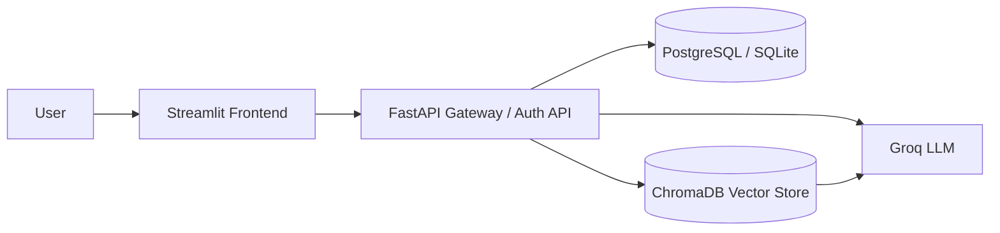

# Architecture Diagram

## Components
- Streamlit frontend for the chat experience
- FastAPI backend for API routes and auth
- SQLAlchemy models for users and chat sessions
- PostgreSQL for production persistence
- ChromaDB for semantic retrieval
- Groq for LLM-based answer generation
